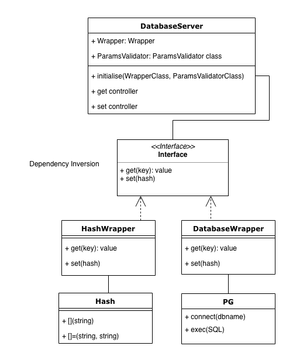

# DatabaseServer Tech Test

A Maker's tech test on week 10.

## Approach

I thought this is an interesting problem to solve. I was thinking about a design that could be easy to change between a database storage and storing information in memory with the smallest change as possible. I came up with a design that adds an extra 'layer' between the datastores and have a specific interface which any wrapper class can implement. I used dependency inversion in my DatabaseServer class initalize method to accept the wrapper class as a parameter.

I had an idea how to want to solve this problem, I made a design but I still wanted to test and play around with it before implementation. I dedicated the playground folder for this purpose. The code that can be found there are incomplete(no edge cases or testing), but has more feature than the one in codebase. It uses puma as a server, the pg gem provides the database connection, but it doesn't use sinatra. Considering currently I couldn't fully finish this project, I still wanted to provide some kind of "prototype" to show an example of the whole idea with an added DatabaseWrapper class.

After I was confident I did enough exploring, I started to work on the main codebase.
I setup the testing framework(Rspec, capybara, rubocop), did the first feature test to setup sinatra and the rest of the setup need to the project.

Then I followed the TDD approach (feature test, unit test, implementation,  refactoring).

## Design



I have 3 classes:
- DatabaseServer
    - responsible for controlling the requests
- ParamsValidator
    - responsible for validating the params
- HashWrapper
    - responsible for writing and retrieving data from a datastore, in this case a Hash.

(An additional class for a database is needed to be added later on.
Check out playground.)

## User stories

```text
As a User,
So that I can store cool stuff in a datastore using my browser,
I want to visit a database server and set a key value pair to store using query strings.
```

```text
As a User,
So that I can check later what I stored for a specific key,
I want to retrieve the value for a key using query strings.
```

## Installation

In the command line:
```bash
git clone git@github.com:rekapap/database_server_tech_test.git
cd database_server_tech_test
bundle install
```

## Usage

In the command line
```bash
ruby app.rb
```

In your browser type your key, value pair to set:
```
http://localhost:4000/set?yourkey=yourvalue
```

In your browser type your key to get:
```
http://localhost:4000/get?key=yourkey
```

## Tests

```bash
rspec
```

## Linter

```bash
rubocop
```
